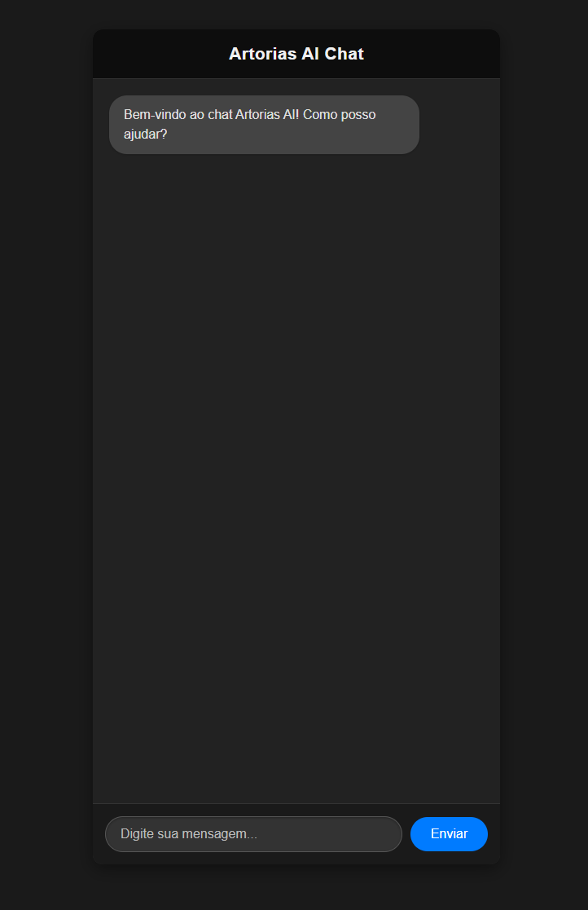

# Artorias AI — Agente Conversacional com IA (Gemini + Flask)

O **Artorias AI** é um agente conversacional inteligente construído com Python e Flask, integrado à API do Gemini da Google. Ele foi criado para atuar como um assistente responsivo e humanizado, capaz de interagir com usuários de forma natural. Pode ser adaptado para atendimento, suporte, consultoria ou qualquer outra aplicação baseada em diálogo com IA.

---

## Funcionalidades

- Recebe mensagens de texto através de uma interface web simples (HTML).
- Gera respostas com inteligência artificial via Gemini API.
- Estrutura leve, baseada em Flask, fácil de manter e expandir.
- Ideal como base para criar bots personalizados.

---

## Tecnologias Utilizadas

- Python 3.x  
- Flask  
- Google Gemini API  
- HTML/CSS (interface simples)

---

## Como Executar Localmente

Clone o repositório e instale as dependências:

```bash
git clone https://github.com/ezequielfb/Artorias-AI.git
cd Artorias-AI
pip install -r requirements.txt
python app_flask.py
```

Depois, acesse `http://localhost:5000` no seu navegador para testar.

---

## Acesso Online (Render)

Você também pode acessar a versão hospedada na web:

(está configurado para atender como uma empresa ficticia "tralhotec" que fornece soluções para serviços em nuvem)

🔗 [Clique aqui para acessar a demo no Render](https://ezequielfb.github.io/Artorias-AI/)

---

## Captura de Tela




---

## Melhorias Futuras

- Interface visual com histórico de conversas.
- Sistema de usuários e autenticação.
- Integração com canais externos (WhatsApp, Telegram, etc.).
- Personalização de "personalidade" do bot.

---

## Licença

MIT — sinta-se livre para usar, modificar e distribuir.
